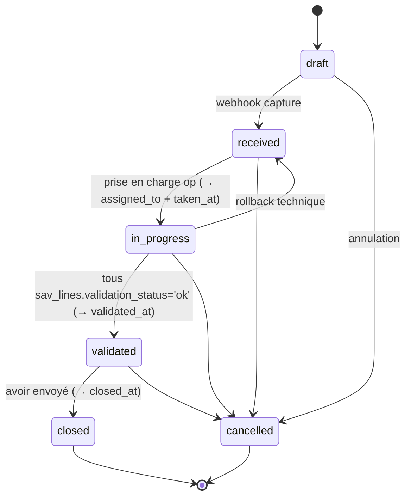

# Contrats API — Routes Vercel serverless (`client/api/`)

> Généré le 2026-04-17 — Epic 1 "Suppression du serveur Infomaniak via OneDrive upload session".
> Remplace `docs/api-contracts-server.md` (archivé avec le serveur Express).

## Vue d'ensemble

Les routes `/api/*` sont des **fonctions serverless Vercel** ([client/api/](../client/api/)) qui portent uniquement la négociation avec Microsoft Graph. Le binaire des fichiers **ne transite pas par Vercel** — il passe directement du navigateur à OneDrive via une `uploadUrl` signée (upload session Microsoft Graph).

### Authentification

Toutes les routes exigent un header **`X-API-Key: <API_KEY>`** (ou `Authorization: Bearer <API_KEY>`). Valeur comparée à la var d'env Vercel `API_KEY`.

### Enveloppe réponse

- Succès : `{ success: true, ...données }`
- Erreur : `{ success: false, error: "<message>" }` + code HTTP approprié (400/403/405/500).

---

## `POST /api/upload-session`

Négocie une upload session OneDrive pour un fichier donné. Retourne une `uploadUrl` signée sur laquelle le client effectue ensuite un PUT binaire direct.

### Request

```json
POST /api/upload-session
Headers:
  X-API-Key: <API_KEY>
  Content-Type: application/json

Body:
{
  "filename": "photo.jpg",
  "savDossier": "SAV_776_25S43",
  "mimeType": "image/jpeg",
  "size": 8388608
}
```

### Validations

| Règle | Erreur si échec |
|-------|------------------|
| `X-API-Key` valide | 403 |
| Méthode = POST | 405 |
| `MICROSOFT_DRIVE_PATH` env configurée | 500 |
| `filename` non vide, string | 400 |
| `mimeType` dans [whitelist](#mime-whitelist) | 400 |
| `size` entier > 0 et ≤ 26 214 400 (25 Mo, constante partagée [client/shared/file-limits.json](../client/shared/file-limits.json)) | 400 |
| `savDossier` non vide après sanitization (`[A-Za-z0-9_-]+`, max 100 chars) | 400 |

### Response 200

```json
{
  "success": true,
  "uploadUrl": "https://<tenant>.sharepoint.com/_api/v2.0/drive/items/.../uploadSession?...",
  "expiresAt": "2026-04-17T20:00:00Z",
  "storagePath": "SAV_Images/SAV_776_25S43/photo.jpg"
}
```

### Comportement interne

1. Sanitize `savDossier` (`[^a-zA-Z0-9_-]` → `_`, max 100 chars) et `filename` (règles SharePoint).
2. `ensureFolderExists("SAV_Images/<sanitizedFolder>")` — crée les dossiers manquants.
3. `createUploadSession` avec `'@microsoft.graph.conflictBehavior': 'rename'` (renomme auto en cas de conflit).

---

## `POST /api/folder-share-link`

Crée (ou récupère) un lien de partage anonyme view-only pour un dossier SAV. Utilisé par le webhook Make.com pour inclure `shareLink` dans le payload.

### Request

```json
POST /api/folder-share-link
Headers:
  X-API-Key: <API_KEY>
  Content-Type: application/json

Body:
{
  "savDossier": "SAV_776_25S43"
}
```

### Response 200

```json
{
  "success": true,
  "shareLink": "https://1drv.ms/..."
}
```

### Validations

| Règle | Erreur si échec |
|-------|------------------|
| `X-API-Key` valide | 403 |
| Méthode = POST | 405 |
| `savDossier` non vide après sanitization | 400 |
| Dossier OneDrive existant | 500 (wrap "Dossier non trouvé") |

### Comportement interne

Résout le dossier par chemin (`/root:/SAV_Images/<sanitized>`) puis `POST /items/<id>/createLink` avec `{ type: "view", scope: "anonymous" }` — comportement **strictement identique** à l'ancien endpoint Express.

---

## MIME Whitelist

Liste exhaustive (source : [client/api/_lib/mime.js](../client/api/_lib/mime.js)).

```
image/*                                        # toutes images
application/pdf
application/vnd.openxmlformats-officedocument.spreadsheetml.sheet    # xlsx
application/vnd.ms-excel                                              # xls
application/vnd.openxmlformats-officedocument.wordprocessingml.document  # docx
application/msword                                                    # doc
application/zip
application/x-zip-compressed
text/plain
text/csv
```

---

## Flow complet (3 étapes côté client)

```
1. Navigateur → Vercel: POST /api/upload-session
                        → { uploadUrl, storagePath }

2. Navigateur → Microsoft Graph (direct): PUT <uploadUrl>
                                          Headers: Content-Range: bytes 0-<size-1>/<size>
                                          Body: <binaire>
                                          → DriveItem { id, webUrl, size, ... }

3. Navigateur → Vercel: POST /api/folder-share-link { savDossier }
                        → { shareLink }

4. Navigateur → Make.com: POST <webhook> { fileUrls, shareLink, ... }
```

Étape 2 : le binaire **ne passe jamais par Vercel** (contourne la limite 4 Mo).

---

## `GET/PUT /api/self-service/draft` (Epic 2 Story 2.3)

Brouillon formulaire adhérent, un par `member_id`. Authentification magic-link requise via cookie `sav_session`.

### `GET /api/self-service/draft`

- **Auth** : `withAuth({ types: ['member'] })`, 401 sans session, 403 si session `operator`.
- **Response 200** :
  - `{ "data": null }` si aucun brouillon (vierge).
  - `{ "data": { "data": {<objet libre>}, "lastSavedAt": "<ISO 8601>" } }` si existant.

### `PUT /api/self-service/draft`

- **Auth** : identique GET.
- **Rate limit** : 120 PUT / minute / membre (`bucket=draft:save`, key = `member:<id>`).
- **Request** : `{ "data": <object> }`. Objet libre, serialisé ≤ 256 KiB (AC #7).
- **Response 200** : `{ "data": { "lastSavedAt": "<ISO 8601>" } }`.
- **Response 400** : `VALIDATION_FAILED` si body invalide ou `data` > 256 KiB.

### Autosave côté front

Composable [`useDraftAutoSave`](../client/src/features/self-service/composables/useDraftAutoSave.ts) + composant [`DraftStatusBadge`](../client/src/features/self-service/components/DraftStatusBadge.vue). Debounce 800 ms, retry expo 2× sur 5xx, hydratation au mount.

### Purge

Rétention 30 jours depuis `created_at`. Purge via cron dispatcher (voir ci-dessous).

---

## Cron dispatcher unique (Epic 2 Story 2.3)

Vercel Hobby = 2 crons max. Pour rester sous la limite avec 3 jobs (cleanup-rate-limits, purge-tokens, purge-drafts), on centralise derrière un endpoint unique [`/api/cron/dispatcher`](../client/api/cron/dispatcher.ts) planifié `0 * * * *` UTC.

| Heure UTC | Jobs exécutés |
|-----------|----------------|
| Chaque heure | `cleanupRateLimits` (`rate_limit_buckets` dont fenêtre > 2 h) |
| 03:00 | + `purgeTokens` (`magic_link_tokens` expirés/consommés > 24 h) |
| 03:00 | + `purgeDrafts` (`sav_drafts` créés > 30 jours) |

Résilience : chaque `run*` est try/catch isolé — un job qui plante laisse les suivants s'exécuter. Dispatcher renvoie toujours 200 avec le détail par job (pas de retry Vercel agressif).

Les handlers individuels [`purge-tokens.ts`](../client/api/cron/purge-tokens.ts), [`cleanup-rate-limits.ts`](../client/api/cron/cleanup-rate-limits.ts), [`purge-drafts.ts`](../client/api/cron/purge-drafts.ts) sont conservés pour test manuel via `curl -H "Authorization: Bearer $CRON_SECRET"`.

---

## `POST /api/self-service/upload-session` + `POST /api/self-service/upload-complete` (Epic 2 Story 2.4)

Flow upload OneDrive 3 étapes côté adhérent connecté. Équivalent du `api/upload-session.js` legacy (API-key Make.com) mais scopé à une session magic-link membre.

### Flow front complet

1. **`POST /api/self-service/upload-session`** — Auth `withAuth({ types: ['member'] })` + rate-limit 30/min/membre.
   - Body : `{ filename, mimeType, size, savReference? }`.
   - Validations : MIME whitelist (cf. [mime.js](../client/api/_lib/mime.js)), taille ≤ 25 Mo (`shared/file-limits.json`), filename sanitization.
   - Si `savReference` : scope check `sav.member_id = user.sub` (403 sinon, 404 si introuvable). Dossier = `{MICROSOFT_DRIVE_PATH}/{reference}`.
   - Sinon : dossier brouillon isolé `{MICROSOFT_DRIVE_PATH}/drafts/{member_id}/{timestamp}-{rand}`.
   - Response 200 : `{ data: { uploadUrl, expiresAt, storagePath, sanitizedFilename } }`.
2. **Chunks PUT 4 MiB** directement vers `uploadUrl` (Graph, contourne Vercel body-limit). Header `Content-Range: bytes START-END/TOTAL`.
3. **`POST /api/self-service/upload-complete`** — Auth identique + rate-limit 30/min.
   - Body (XOR strict) : `{...fileRefs, savReference}` OU `{...fileRefs, draftAttachmentId (UUID)}`.
   - Mode SAV : INSERT `sav_files (source='member-add')` + audit `actor_member_id`.
   - Mode brouillon : append dans `sav_drafts.data.files[]` (dédup par `draftAttachmentId`).
   - Response 200 : `{ data: { savFileId | draftAttachmentId, createdAt } }`.

Composable [`useOneDriveUpload`](../client/src/features/self-service/composables/useOneDriveUpload.ts) et composant [`FileUploader.vue`](../client/src/features/self-service/components/FileUploader.vue) encapsulent le flow complet avec barre de progression, retry expo 2×, et emit `@uploaded`/`@error`.

Le legacy [`api/upload-session.js`](../client/api/upload-session.js) (API-key Make.com) reste actif pour le flow Phase 1 pendant le shadow run — à déprécier Epic 7.

---

## `POST /api/webhooks/capture` (Epic 2 Story 2.2)

Réception webhook Make.com signé HMAC-SHA256. Cf. [handler](../client/api/webhooks/capture.ts) et section `integration-architecture.md` §Base de données — schéma capture SAV.

- **Auth** : HMAC header `X-Webhook-Signature: sha256=<hex>` sur raw body.
- **Env requise** : `MAKE_WEBHOOK_HMAC_SECRET` (32 bytes hex, partagé scénario Make.com).
- **Rate limit** : 60 POST / min / IP.
- **Idempotence** : côté Make.com (pas côté serveur — 2 POST identiques → 2 SAV distincts).
- **Persistence** : RPC atomique Postgres `capture_sav_from_webhook(jsonb)` (1 transaction).
- **Traçabilité** : `webhook_inbox` rempli AVANT vérif signature (401 audités).

---

## Variables d'environnement Vercel

| Variable | Scope | Rôle |
|----------|-------|------|
| `MICROSOFT_CLIENT_ID` | Preview + Prod | App registration Azure |
| `MICROSOFT_TENANT_ID` | Preview + Prod | Tenant Azure |
| `MICROSOFT_CLIENT_SECRET` | Preview + Prod | Secret app Azure |
| `MICROSOFT_DRIVE_ID` | Preview + Prod | ID du Drive OneDrive/SharePoint cible |
| `MICROSOFT_DRIVE_PATH` | Preview + Prod | Racine des SAV dans le Drive (ex: `SAV_Images`) |
| `API_KEY` | Preview + Prod | Clé d'API partagée avec `VITE_API_KEY` côté client |

Ces variables sont lues **uniquement** par les fonctions serverless ([client/api/_lib/graph.js](../client/api/_lib/graph.js)) — elles ne sont **jamais** exposées au bundle client (pas de préfixe `VITE_`).

---

## `GET /api/sav` (Epic 3 Story 3.2)

Liste les SAV en back-office avec filtres combinables, recherche plein-texte française (tsvector) et pagination par cursor opaque stable. Utilisé par la vue liste opérateur (Story 3.3).

### Auth

Session opérateur requise (cookie `sav_session` JWT HS256, `type='operator'`). `401` sans cookie, `403` si session membre. Rate-limit `120/minute/opérateur` (clé `op:<sub>`).

### Query string

| Paramètre | Type | Description |
|-----------|------|-------------|
| `status` | `enum` ou CSV/array | `draft`/`received`/`in_progress`/`validated`/`closed`/`cancelled`. `status=received,in_progress` ou `status=received&status=in_progress`. |
| `from` / `to` | ISO 8601 datetime | Encadre `received_at`. |
| `invoiceRef` | string ≤64 | `.ilike('%...%')` sur `invoice_ref`. |
| `memberId` | bigint | Filtre par adhérent exact. |
| `groupId` | bigint | Filtre par groupe exact. |
| `assignedTo` | bigint \| `'unassigned'` | Filtre opérateur assigné, ou SAV non-assignés. |
| `tag` | string ≤64 | `@>` sur `tags[]`. |
| `q` | string ≤200 | Recherche full-text via `websearch_to_tsquery('french', q)` sur `sav.search` (tsvector = reference + invoice_ref + notes_internal + tags). Extension : si `q` matche `SAV-YYYY-NNNNN` ou contient ≥5 chiffres consécutifs, OR avec `reference.ilike.%q%`. |
| `limit` | int 1-100 | Défaut 50. |
| `cursor` | opaque base64url | Retourné par l'appel précédent. |

Erreur Zod sur format → `400 VALIDATION_FAILED` avec `details: [{ field, message }]`.

### Réponse 200

```json
{
  "data": [
    {
      "id": 1234,
      "reference": "SAV-2026-00042",
      "status": "in_progress",
      "receivedAt": "2026-03-01T08:12:00.000Z",
      "takenAt": "2026-03-01T09:00:00.000Z",
      "validatedAt": null,
      "closedAt": null,
      "cancelledAt": null,
      "version": 2,
      "invoiceRef": "FAC-2026-0555",
      "totalAmountCents": 12400,
      "tags": ["urgent", "à rappeler"],
      "member": { "id": 10, "firstName": "Jean", "lastName": "Dubois", "email": "j.dubois@example.com" },
      "group": { "id": 3, "name": "Groupe Nord" },
      "assignee": { "id": 42, "displayName": "Amélie Op" }
    }
  ],
  "meta": {
    "cursor": "eyJyZWMiOiIyMDI2LTAzLTAxVDA4OjEyOjAwLjAwMFoiLCJpZCI6MTIzNH0",
    "count": 1234,
    "limit": 50
  }
}
```

`meta.cursor` = `null` quand il n'y a plus de page suivante. `meta.count` = total après application des filtres (obtenu via `count: 'exact'` Supabase). `cursor` est un **blob opaque** : ne pas tenter de le parser côté client, simplement le réinjecter dans la requête suivante (`?cursor=<...>`).

### Pagination cursor stable

Tri : `(received_at DESC, id DESC)`. Cursor = base64url(JSON `{ rec, id }`). Condition SQL : `received_at.lt.${rec} OR (received_at.eq.${rec} AND id.lt.${id})` — tuple-compare qui évite les doublons quand plusieurs SAV partagent la même milliseconde. Index `idx_sav_received_id_desc` (migration `20260422130000`) rend le seek O(log n).

### Routing Vercel

L'endpoint est servi par `client/api/sav/[[...slug]].ts` (catch-all optionnel) qui dispatche vers `listSavHandler` (dans `client/api/_lib/sav/list-handler.ts`) quand `slug` est vide et méthode = `GET`. Ce catch-all sera réutilisé par les Stories 3.4 → 3.7 (détail, transitions, assignation, édition lignes, tags, commentaires, duplication) — un seul slot Vercel pour tout le domaine SAV back-office.

## Références

- [client/api/_lib/graph.js](../client/api/_lib/graph.js) — MSAL + Graph client singleton
- [client/api/_lib/onedrive.js](../client/api/_lib/onedrive.js) — ensureFolderExists, createUploadSession, createShareLink, getShareLinkForFolderPath
- [client/api/_lib/auth.js](../client/api/_lib/auth.js) — requireApiKey
- [client/api/_lib/sanitize.js](../client/api/_lib/sanitize.js) — sanitizeFilename, sanitizeSavDossier
- [client/api/_lib/mime.js](../client/api/_lib/mime.js) — whitelist MIME
- [Microsoft Graph — createUploadSession](https://learn.microsoft.com/en-us/graph/api/driveitem-createuploadsession)
- [Microsoft Graph — createLink](https://learn.microsoft.com/en-us/graph/api/driveitem-createlink)
- [VERIFICATION_CARACTERES.md](../VERIFICATION_CARACTERES.md) — règles filename SharePoint

## `GET /api/sav/:id` (Epic 3 Story 3.4)

Détail complet d'un SAV pour back-office : entête + lignes + fichiers + commentaires (both `all` et `internal`) + 100 derniers événements audit. Servi par le même catch-all `api/sav/[[...slug]].ts` (slot Vercel unique).

### Auth

Session opérateur requise. 401 si pas de cookie, 403 si session membre. Rate-limit 240/min/opérateur (clé `op:<sub>`).

### Paramètre

`:id` = bigint positif. Validation regex `/^\d+$/` au router. 400 `VALIDATION_FAILED` si absent ou invalide.

### Réponse 200

```json
{
  "data": {
    "sav": { /* cf. shape liste + lines[], files[], member.phone, member.pennylaneCustomerId */ },
    "comments": [ { "id", "visibility", "body", "createdAt", "authorMember"?, "authorOperator"? } ],
    "auditTrail": [ { "id", "action", "actorOperator"?, "actorMember"?, "actorSystem", "diff", "createdAt" } ]
  }
}
```

### Performance

3 requêtes Supabase, les deux annexes en parallèle via `Promise.all`. Aucun appel Graph — l'intermittence OneDrive n'affecte que les vignettes image côté FE (fallback `onerror` + bouton retry).


## `PATCH /api/sav/:id/status` + `PATCH /api/sav/:id/assign` (Epic 3 Story 3.5)

Transitions de statut et assignation opérateur, protégées par **verrou optimiste CAS** sur `version`. Les deux endpoints passent par une RPC PL/pgSQL (migration `20260422140000_sav_transitions.sql`) pour garantir l'atomicité `check version + check state-machine + UPDATE + INSERT email_outbox + INSERT sav_comments note`.

### State-machine (Mermaid)



### Body `PATCH /api/sav/:id/status`

```json
{ "status": "in_progress", "version": 2, "note": "optionnel (≤500c, → sav_comments internal)" }
```

### Body `PATCH /api/sav/:id/assign`

```json
{ "assigneeOperatorId": 42, "version": 2 }
```

`assigneeOperatorId: null` = désassigner.

### Erreurs métier

| Code HTTP | `error.code` | `details.code` | Signification |
|-----------|--------------|----------------|---------------|
| 404 | `NOT_FOUND` | `ASSIGNEE_NOT_FOUND` (si applicable) | SAV ou opérateur destinataire inexistant |
| 409 | `CONFLICT` | `VERSION_CONFLICT` | `expectedVersion` ≠ `currentVersion` — recharger puis retenter |
| 422 | `BUSINESS_RULE` | `INVALID_TRANSITION` | Transition hors state-machine (inclut `from`, `to`, `allowed[]`) |
| 422 | `BUSINESS_RULE` | `LINES_BLOCKED` | Tentative → `validated` avec lignes `validation_status != 'ok'` (inclut `blockedLineIds[]`) |

### Effets de bord DB

- Trigger audit `trg_audit_sav` capture le `diff { before, after }` automatiquement (acteur via GUC `app.actor_operator_id` setté par la RPC).
- Table `email_outbox` INSERT `status='pending'` pour transitions `in_progress`/`validated`/`closed`/`cancelled` (pas pour rollback `in_progress → received`). Epic 6 matérialise le `html_body` via `kind` à l'envoi.
- Si `note` fourni : INSERT `sav_comments` `visibility='internal'`, auteur opérateur.


## `POST /api/sav/:id/credit-notes` (Epic 4 Story 4.4)

Émission atomique d'un **numéro d'avoir** (+ ligne `credit_notes`) et déclenchement asynchrone de la génération PDF (Story 4.5). Règle métier V1 : **1 SAV = au plus 1 avoir** — contrainte défendue applicativement (gate amont) + côté DB (migration `20260427120000_credit_notes_unique_sav.sql` : `UNIQUE(sav_id)`).

### Auth

`withAuth({ types: ['operator'] })` via le dispatcher `api/sav.ts`. Rate-limité à **10 req/min par opérateur** (bucket `credit-notes:emit`).

### Body

```json
{ "bon_type": "AVOIR" }
```

`bon_type` ∈ `{ 'AVOIR', 'VIREMENT BANCAIRE', 'PAYPAL' }`. Zod `.strict()` rejette toute clé inconnue (400 `INVALID_BODY`).

### Réponse 200

```json
{
  "data": {
    "number": 42,
    "number_formatted": "AV-2026-00042",
    "pdf_web_url": null,
    "pdf_status": "pending",
    "issued_at": "2026-04-27T10:23:04.102Z",
    "totals": {
      "total_ht_cents": 15000,
      "discount_cents": 0,
      "vat_cents": 825,
      "total_ttc_cents": 15825
    }
  },
  "message": "Avoir émis. Génération PDF en cours."
}
```

Le numéro est renvoyé immédiatement. Le PDF est généré en fire-and-forget (stub Story 4.4, pipeline réelle Story 4.5). L'UI poll `GET /api/credit-notes/:number/pdf` (202 → 302).

### Erreurs

| HTTP | `error.code` | `details.code` | Signification |
|------|--------------|----------------|---------------|
| 400 | `VALIDATION_FAILED` | — | `:id` non-bigint (dispatcher `sav.ts`) |
| 400 | `VALIDATION_FAILED` | `INVALID_BODY` | Body non-JSON ou clé inconnue (`.strict()`) |
| 404 | `NOT_FOUND` | `SAV_NOT_FOUND` | SAV absent (gate ou RPC race) |
| 409 | `CONFLICT` | `INVALID_SAV_STATUS` | Statut ≠ `in_progress` ou `validated` — inclut `current_status` |
| 409 | `CONFLICT` | `CREDIT_NOTE_ALREADY_ISSUED` | App-level check **ou** `unique_violation` race — inclut `number_formatted` |
| 422 | `BUSINESS_RULE` | `INVALID_BON_TYPE` | Enum invalide |
| 422 | `BUSINESS_RULE` | `NO_LINES` | SAV sans ligne |
| 422 | `BUSINESS_RULE` | `NO_VALID_LINES` | ≥1 ligne `validation_status != 'ok'` — inclut `blocking_lines[{ id, line_number, validation_status, validation_message }]` (max 10) |
| 429 | `RATE_LIMITED` | — | Bucket `credit-notes:emit` dépassé |
| 500 | `SERVER_ERROR` | `ACTOR_INTEGRITY_ERROR` | RPC `ACTOR_NOT_FOUND` (actor forgé) |
| 500 | `SERVER_ERROR` | `CREDIT_NOTE_ISSUE_FAILED` | Exception RPC inattendue |

### Effets de bord DB

- RPC `issue_credit_number` (Story 4.1, signature 7 args) : `UPDATE credit_number_sequence RETURNING + INSERT credit_notes` dans une transaction unique → **zéro collision, zéro trou** (NFR-D3).
- Trigger `trg_audit_credit_notes` capture `action='created'` (acteur via GUC `app.actor_operator_id`).
- `sav.status` **n'est pas modifié** (V1 — opérateur clôture manuellement après vérification PDF, cf. Story 3.5 state-machine).
- `pdf_web_url` reste NULL jusqu'à l'upload OneDrive (Story 4.5).

### Calcul totaux

Le handler :

1. Charge `sav_lines` et rejette si ≥1 ligne `validation_status != 'ok'` (422 `NO_VALID_LINES`).
2. Utilise `credit_amount_cents` figé par trigger (Story 4.2) — **pas de recalcul** : la source de vérité est DB.
3. Résout la remise responsable live : `member.is_group_manager && member.group_id === sav.group_id`.
4. Appelle `computeCreditNoteTotals` (`api/_lib/business/vatRemise.ts`, Story 4.2) qui applique la remise **avant** TVA, ligne par ligne.
5. Passe les 4 totaux à la RPC (seule source de vérité comptable DB).


## `GET /api/credit-notes/:number/pdf` (Epic 4 Story 4.4)

Re-download du PDF d'un avoir émis. Accepte deux formats de `:number` :

- `bigint` (ex: `42`) → lookup sur `credit_notes.number`
- `AV-YYYY-NNNNN` (ex: `AV-2026-00042`) → lookup sur `credit_notes.number_formatted`

### Auth

`withAuth({ types: ['operator'] })` via le dispatcher `api/credit-notes.ts`. Rate-limité à **120 req/min par opérateur** (polling pendant la génération async).

V1 opérateur uniquement — Story 6.4 ouvrira au self-service adhérent (même endpoint + filtrage RLS).

### Réponses

| HTTP | Corps / header | Signification |
|------|----------------|---------------|
| 302 | `Location: <pdf_web_url>`, `Cache-Control: no-store` | PDF disponible OneDrive — suivre le redirect |
| 202 | `{ data: { code: 'PDF_PENDING', retry_after_seconds: 5, number, number_formatted } }` | Génération async pas encore terminée — poller toutes les 5s |
| 400 | `details.code = 'INVALID_CREDIT_NOTE_NUMBER'` | Format `:number` invalide |
| 404 | `details.code = 'CREDIT_NOTE_NOT_FOUND'` | Avoir inexistant |
| 401 | `UNAUTHENTICATED` | Cookie opérateur manquant |
| 500 | `SERVER_ERROR` | Erreur lecture DB |

### Routing Vercel

```
GET /api/credit-notes/:number/pdf
  → api/credit-notes.ts?op=pdf&number=:number
```

Nouveau dispatcher dédié (vs extension `sav.ts`) : sémantique différente (redirect OneDrive, RLS future adhérent). Budget Vercel Hobby : ce fichier porte le compteur à 12 serverless functions (plafond).

